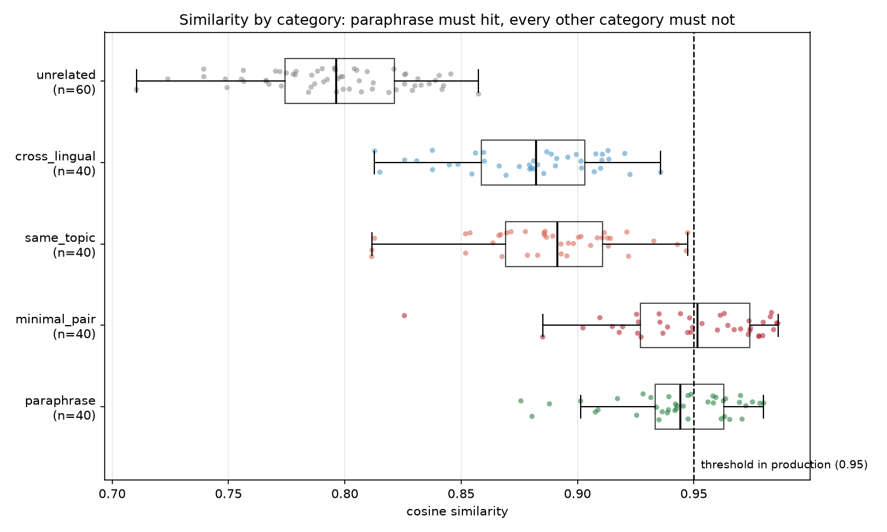
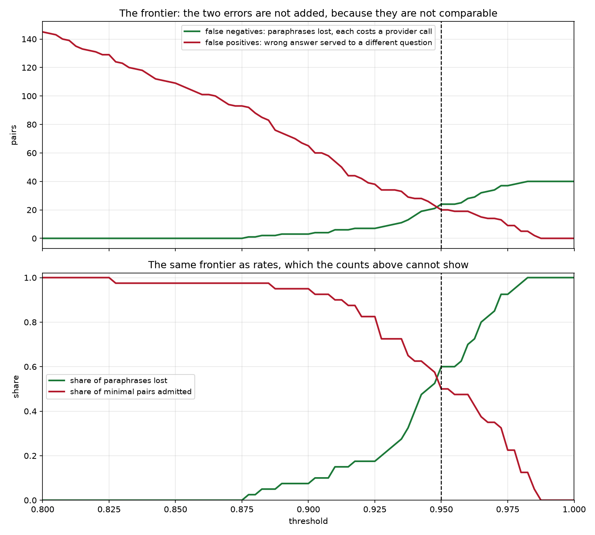
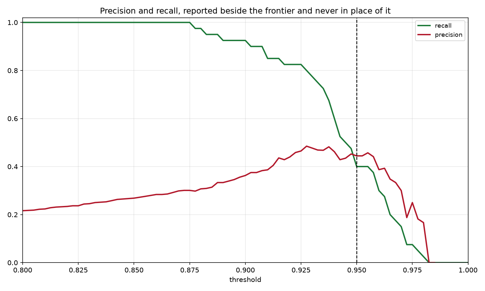
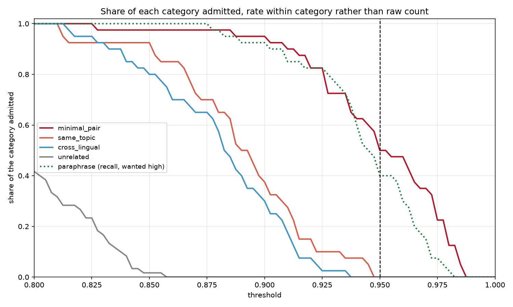
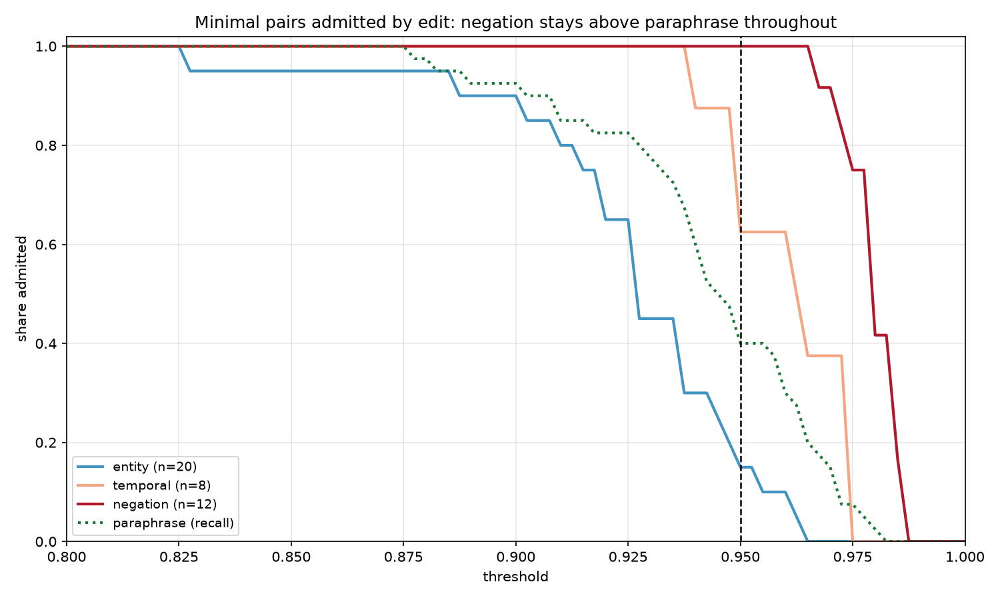
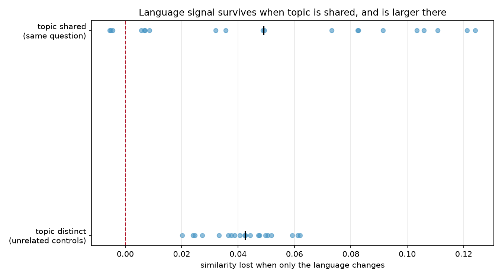
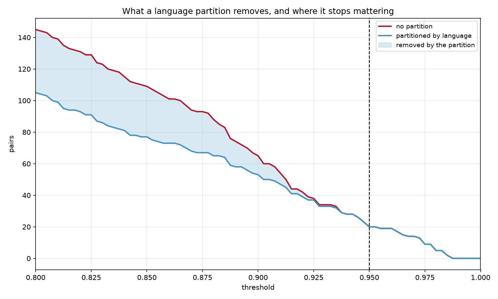
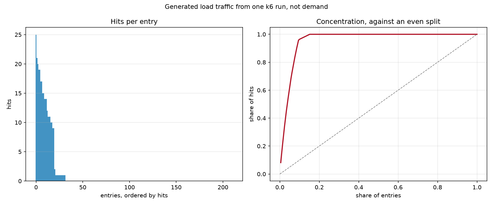
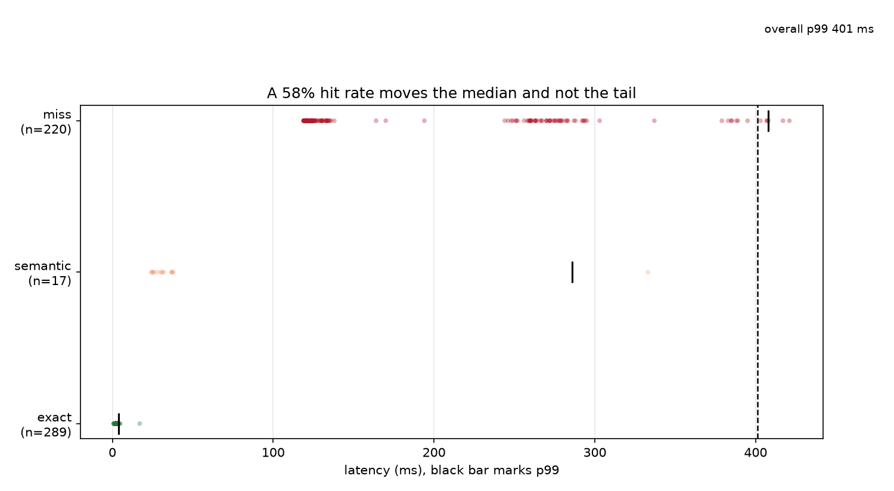

# Semantic cache quality

Turning the point observations in ADR 0001 into systematic measurement, and
using it to decide what was left open.

Companion to ADRs 0007, 0008 and 0009. Everything here is reproducible from
`evals/`.

## Methodology

**Node computes the numbers, Python analyses them.** The suite was to be written
entirely in Python, loading the exact ONNX artefacts the gateway had already
downloaded. The parity check failed: same file, same tokenizer, same pooling,
cosine 0.9895 between vectors that should have been identical.

Most of the gap was the graph optimisation level, worth five orders of magnitude
from the same file. A residue of roughly 1e-02 on six of nine texts was never
explained. ADR 0007 has the detail.

What made it disqualifying was not the size of the disagreement but its size
against what the suite has to resolve. Converted into pair similarity, the
quantity the sweep actually consumes, the two runtimes disagree by up to
**0.0082** where ADR 0001 measured the separating band at **0.0017** — nearly
five times the effect being studied.

So the runtime that serves the model produces the numbers. The scoring script
imports the gateway's compiled worker rather than reimplementing it, so there is
no second copy of the prefix, pooling and normalisation to drift. Python never
loads ONNX, and the environment makes that structural rather than disciplinary:
`onnxruntime` is not an installed dependency.

The handoff is a versioned file carrying provenance with the numbers:

```
Xenova/multilingual-e5-small q8 via @huggingface/transformers on
onnxruntime-node (transformers 4.2.0, onnxruntime-node 1.24.3, node v24.19.0),
dataset v1 2820bb5f5c0f
```

`load_results` refuses a file with no provenance, and refuses one whose dataset
digest does not match `pairs.jsonl` on disk. An analysis cannot silently run
against numbers from an older dataset.

```
uv run python scripts/build_dataset.py       topics.json    -> pairs.jsonl
node scripts/score_pairs.mjs                 pairs.jsonl    -> similarities.json, vectors.json
.\evals\scripts\export_cache_data.ps1        postgres       -> requests.csv, cache_entries.csv
```

## The dataset

220 labelled pairs over 20 topics, each carrying four question forms in English
and Portuguese: the base question, a paraphrase, a sibling question on the same
subject, and a minimal edit that changes the answer. The combination rules live
in `scripts/build_dataset.py` rather than in the data, so the pairing logic is
reviewable as code instead of 220 buried judgement calls.

| Category | Built from | Should hit | n |
|---|---|---|---|
| `paraphrase` | base ↔ paraphrase, same language | **yes** | 40 |
| `same_topic` | base ↔ sibling, same language | no | 40 |
| `minimal_pair` | base ↔ minimal edit, same language | no | 40 |
| `cross_lingual` | English ↔ Portuguese, same question | no | 40 |
| `unrelated` | base of one topic ↔ base of another | no | 60 |

Minimal pairs split three ways: **entity** (20), **negation** (12), **temporal**
(8). The unrelated controls pair topic *i* with topic *i+7*, coprime with 20 so
every topic appears twice; 40 are same-language and 20 cross both, which is what
isolates language from topic.

**Volume.** 40 to 60 per category, chosen against what a sweep must resolve. One
mislabelled pair moves precision or recall by about 2.5 points — visible without
dominating. The binding cost is not compute (scoring takes 8 seconds) but that
every pair can still be read by a person.

### Biases

The pairs were written by the person building the gateway, after seeing how the
model behaves.

- **The expected answer was known while writing.** ADR 0001 had already recorded
  that cross-language pairs land near same-language paraphrases.
- **The minimal pairs are adversarial by construction.** They show what the
  embedding can miss, not how often it misses in practice.
- **Topics were chosen for being separable**, which flatters the low end of the
  distribution. Real traffic to one gateway is more clustered.
- **Both languages were written by one author, and English is not their first
  language.** A systematic register difference between the two halves cannot be
  ruled out, and it lands directly on the cross-lingual comparison.
- **There is no second annotator**, so there is no inter-annotator agreement
  figure and disagreement over what counts as a paraphrase is invisible.

The conclusions below are about **whether a separating threshold exists**, which
runs in the direction the bias cannot help: pairs written to be easy still do not
separate. Nothing here supports a claim about rates in production.

## Threshold sweep



| Category | n | min | p05 | p25 | **median** | p75 | p95 | max |
|---|---|---|---|---|---|---|---|---|
| `paraphrase` *(must hit)* | 40 | 0.8757 | 0.8876 | 0.9334 | **0.9441** | 0.9628 | 0.9754 | 0.9800 |
| `minimal_pair` | 40 | 0.8256 | 0.9015 | 0.9271 | **0.9515** | 0.9742 | 0.9843 | 0.9862 |
| `same_topic` | 40 | 0.8116 | 0.8127 | 0.8691 | 0.8912 | 0.9109 | 0.9431 | 0.9474 |
| `cross_lingual` | 40 | 0.8128 | 0.8252 | 0.8588 | 0.8820 | 0.9031 | 0.9204 | 0.9358 |
| `unrelated` | 60 | 0.7105 | 0.7394 | 0.7743 | 0.7962 | 0.8214 | 0.8418 | 0.8575 |

**The median of `minimal_pair` sits above the median of `paraphrase`.** Every
paraphrase falls inside the range the minimal pairs span, and 34 of 40 minimal
pairs fall inside the range the paraphrases span. The ordering holds in English
(0.9441 against 0.9509) and Portuguese (0.9450 against 0.9548) independently.

Only `unrelated` is separable from `paraphrase` by any threshold.

### The frontier



The two errors are never summed. A false negative costs a provider call. A false
positive returns an answer to a question nobody asked.

| Threshold | TP | FN | FP | TN | Precision | Recall | FP minimal | FP topic | FP cross | FP unrel |
|---|---|---|---|---|---|---|---|---|---|---|
| 0.85 | 40 | 0 | 109 | 71 | 0.268 | 1.000 | 39 | 37 | 32 | 1 |
| 0.88 | 39 | 1 | 88 | 92 | 0.307 | 0.975 | 39 | 26 | 23 | 0 |
| 0.90 | 37 | 3 | 65 | 115 | 0.363 | 0.925 | 38 | 15 | 12 | 0 |
| 0.92 | 33 | 7 | 42 | 138 | 0.440 | 0.825 | 33 | 6 | 3 | 0 |
| **0.93** | 31 | 9 | 34 | 146 | **0.477** | 0.775 | 29 | 4 | 1 | 0 |
| 0.94 | 24 | 16 | 28 | 152 | 0.462 | 0.600 | 25 | 3 | 0 | 0 |
| **0.95** | 16 | 24 | 20 | 160 | 0.444 | 0.400 | 20 | 0 | 0 | 0 |
| 0.96 | 12 | 28 | 19 | 161 | 0.387 | 0.300 | 19 | 0 | 0 | 0 |
| 0.97 | 6 | 34 | 14 | 166 | 0.300 | 0.150 | 14 | 0 | 0 | 0 |
| 0.98 | 1 | 39 | 5 | 175 | 0.167 | 0.025 | 5 | 0 | 0 | 0 |
| 0.99 | 0 | 40 | 0 | 180 | n/a | 0.000 | 0 | 0 | 0 | 0 |

**Peak precision over the whole range is 0.477.** There is no defensible region,
only regions that fail differently. Below 0.90 recall is bought by admitting 32
of 40 cross-lingual pairs. Above 0.97 recall drops to 0.15 while negations still
pass. At 0.99 both errors vanish because the semantic tier no longer exists.

Raw counts are weighted by the dataset's category proportions, which are a
property of how it was written. As rates the curves cross near 0.95 at roughly
**60% of paraphrases lost against 50% of minimal pairs admitted**.

No aggregate is reported in place of these two curves. F1 or accuracy would
average exactly the trade-off being measured. Precision and recall are shown
beside the frontier, never instead of it:



Per category, as a share of each category admitted rather than a raw count:



### At 0.95, the value in production

```
true positives    16   paraphrases served from cache
false negatives   24   paraphrases costing a provider call
false positives   20   pairs served the wrong answer
true negatives   160   correctly refused
precision 0.444   recall 0.400
```

**All 20 false positives are minimal pairs.** `same_topic`, `cross_lingual` and
`unrelated` are each at zero.

The threshold looks calibrated because it handles the easy categories perfectly.
What it cannot see is the case where two prompts are nearly identical and the
answers are opposite, and that case supplies 100% of its errors.

### Which edits the model misses



| Threshold | entity (n=20) | temporal (n=8) | negation (n=12) |
|---|---|---|---|
| 0.90 | 18 / 20 (90%) | 8 / 8 (100%) | 12 / 12 (100%) |
| 0.93 | 9 / 20 (45%) | 8 / 8 (100%) | 12 / 12 (100%) |
| **0.95** | 3 / 20 (15%) | 5 / 8 (62%) | **12 / 12 (100%)** |
| 0.97 | 0 / 20 (0%) | 3 / 8 (38%) | 11 / 12 (92%) |
| 0.98 | 0 / 20 (0%) | 0 / 8 (0%) | 5 / 12 (42%) |

Entity sits entirely to the left of the paraphrase recall curve and negation
entirely to the right, at every threshold. Entity swaps are rejected before
paraphrases start being lost; negations are admitted more often than paraphrases
everywhere.

Treating `minimal_pair` as one category would hide that a third of it is
detectable and a third is invisible.

```
0.9856  How does a suspension bridge carry load through its main cables?
        How does a suspension bridge carry load without using its main cables?
```

That pair scores higher than every paraphrase in the dataset, and the two
questions are opposites.

### What this means

**Embedding similarity measures how close two prompts are in subject matter, not
whether they have the same answer.** `multilingual-e5-small` is a retrieval
model; under that objective a question and its negation should be close, because
they are relevant to the same material.

A threshold is one scalar cut through one metric, and works only if the metric
orders should-hit above must-not-hit. The ordering is inverted, so this is a
choice-of-signal problem and not a calibration problem. ADR 0008 records it.

## Language partitioning

ADR 0001 deferred this to be decided against measured hit rates. The order was
fixed: is the signal already in the embedding, does a light classifier solve it,
and only then a new dependency.

**The first option succeeded, so the other two were never evaluated.** Nearest
centroid, leave one out over all 160 texts — two mean vectors and a dot product:

```
accuracy 1.0000    en 1.0000    pt 1.0000
margin min 0.0176  median 0.0456
misclassified none
```

Cost is **2.7 µs per prompt** over 200 000 runs, against the roughly 40 ms the
embedding already takes.



The signal was measured in two regimes, paired by topic, because the first
figure came from controls where the two sides also differ in subject:

| Regime | n | median gap | min | max | at or below 0 |
|---|---|---|---|---|---|
| topic distinct | 20 | 0.0425 | 0.0202 | 0.0620 | 0 |
| topic shared | 20 | **0.0490** | −0.0055 | 0.1242 | **3** |

It does not submerge — the shared-topic gap is larger. But **in 3 of 20 topics
the cross-language pair outscored the same-language paraphrase**. The pair-level
signal is noisy and sometimes inverts; the per-prompt readout never does. A
similarity collapses 384 dimensions into one scalar while the centroid uses the
direction, and language survives averaging but not projection onto the one axis
joining two particular prompts.

### What a partition would buy



| Threshold | Recall | FP no partition | FP partitioned | Removed |
|---|---|---|---|---|
| 0.88 | 0.975 | 88 | 65 | 23 |
| 0.90 | 0.925 | 65 | 53 | 12 |
| 0.92 | 0.825 | 42 | 39 | 3 |
| **0.95** | 0.400 | 20 | 20 | **0** |

Holding false positives at today's budget of 20, the lowest viable threshold
with a partition is still 0.9500, recall 0.400, 24 paraphrases lost. **A
partition recovers 0 of the 24.**

Top-one retrieval agrees: 17 of 160 texts have a nearest neighbour in the other
language and none reaches 0.95. Paraphrase hit rate is 8/20 in each language,
unchanged either way.

**Decision: do not partition.** Not for cost and not for feasibility — the signal
is free and perfect. A partition removes a category the current threshold already
drives to zero. ADR 0009 records it.

### The trigger that reverses it

Counting only false positives a partition could reach, with minimal pairs
excluded as though some other check caught them:

| Threshold | Recall | FP no partition | FP partitioned |
|---|---|---|---|
| 0.86 | 1.000 | 62 | **34** |
| 0.88 | 0.975 | 49 | **26** |
| 0.90 | 0.925 | 27 | **15** |

Conditional, describing no system that exists. **If any mechanism starts
rejecting minimal pairs, revisit immediately**: a partition then roughly halves
the remaining false positives where recall is 0.925 to 0.975 instead of 0.400.

## Cache value

**Every row analysed here is generated load traffic from one k6 run of 34
seconds.** That is derived from the rows rather than remembered: 100.0% of
prompts carry the `", and how it relates to"` marker of the entropy generator in
ADR 0005, and there is one API key. The distribution of hits per entry below is a
readout of that scenario's configuration, not a property of demand.

The load-test volume from earlier weeks is no longer in the database. What
remains is 526 requests and 211 entries.



| hits | entries |
|---|---|
| 0 | **179** |
| 1 | 11 |
| 2 | 1 |
| 9 to 25 | 20 |

179 of 211 entries (84.8%) were never used, and 20 entries (9.5%) carry 95% of
the 306 hits. The bimodal shape is the scenario read back: the warm pool that
produces the controlled hit rate, plus the entropy stream that never repeats.

### Latency by outcome



Measured hit rate **58.2%**, reported beside the latency.

| Outcome | n | p50 | p95 | p99 | max |
|---|---|---|---|---|---|
| exact | 289 | 2.0 | 3.0 | 4.0 | 17 |
| semantic | 17 | 31.0 | 97.0 | 285.8 | 333 |
| miss | 220 | 124.0 | 383.1 | 407.8 | 421 |
| **overall** | 526 | **3.0** | 279.8 | **401.0** | |

**The median falls 41×. The p99 is 401 ms against 408 ms for a miss, 98% of it.**
A 58% hit rate buys almost nothing at the tail. This extends the week 4 finding
that a semantic hit's p99 is 93% of a miss's, and it is the most defensible
measurement in this section, because latency by outcome does not depend on the
prompt distribution being generated.

`semantic` has n=17. Its p99 is interpolated from seventeen points and is not a
stable estimate.

## What could not be concluded

- **The effect of a disuse expiry policy.** All 211 entries were written within
  34 seconds and the cache was observed for 34 seconds. `disuse_policy_effect`
  requires an observation window of at least ten times the policy window and
  returns nothing for 1 h, 1 d and 7 d. A test proves the refusal is about this
  data and not the question.
- **Whether the hit distribution resembles demand.** It is a scenario parameter.
  **What is missing is not volume, it is origin.** Running k6 for days would
  produce more rows of the same synthetic shape and answer nothing.
- **How often a negated variant of a cached question occurs in practice.** The
  minimal pairs are adversarial by construction; nothing here estimates their
  frequency.
- **Whether another model would separate these categories.** Not measured. The
  dataset is the regression test for any candidate, and ADR 0007's parity
  discipline applies before its numbers are trusted.
- **Inter-annotator agreement.** One annotator.
- **HNSW scaling and Postgres pool limits**, unchanged from the load reports:
  `CacheEntry` never exceeded a few hundred rows.

## Consequences recorded

- ADR 0007, the same ONNX file is not the same model across runtimes.
- ADR 0008, embedding similarity measures subject and not answer equivalence.
- ADR 0009, the cache is not partitioned by language.
- ADR 0001 stands unaltered. It is an accurate record of what was knowable from
  eleven pairs, and the contrast between eleven and eighty is part of the result.
  Its value of 0.95 is confirmed as right for a reason it did not know.
- The gateway is unchanged. It runs at 0.95 with the behaviour measured here,
  which is now documented rather than assumed.
